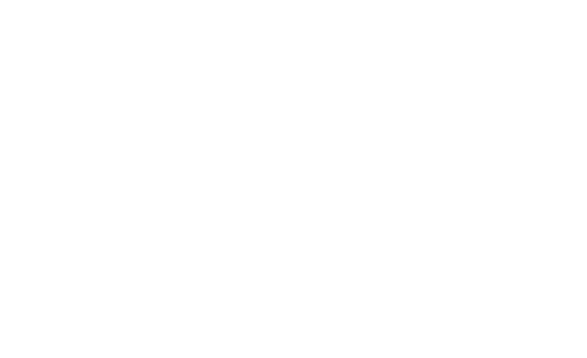

<h1 align="center">Database Architecture - Portal PJI</h1>

This document describes the database structure, relationships, and design decisions for the Portal PJI.

### Overview
This database models the core flow of a policy subscription platform. It supports.
- Customer registration and management
- Product (policy plans) catalog
- Payment processing and tracking
- Session handling for user interactions
- Verifications processes for identity and payment validation

### Database Design Layers

This sections presents the database design across its three main layers: conceptual, logical and physical.

<details>
<summary>Conceptual Design (ER Diagram)</summary>

<div align="center">
    
</div>
</details>

<details>
<summary>Logical Design (Relational Model)</summary>

<div align="center">
    
</div>
</details>

<details>
<summary>Physical Design (SQL Schema)</summary>

```sql
CREATE DATABASE portal_pji_project; -- Crea la base de datos llamada `portal_pji_project`

USE portal_pji_project;             -- Define la base de datos a utilizar.

CREATE TABLE customer (                                              
  customer_id    CHAR(36)      NOT NULL,                             
  name           VARCHAR(100)  NOT NULL,                             
  email          VARCHAR(100)  NOT NULL,                             
  phone          VARCHAR(25)   NOT NULL,                                    
  address        VARCHAR(100)  NOT NULL,                                           
  active         TINYINT(1)    NOT NULL DEFAULT 1,                    
  created_at     DATETIME      NOT NULL DEFAULT CURRENT_TIMESTAMP,      
  updated_at     DATETIME      NOT NULL DEFAULT CURRENT_TIMESTAMP,                     
  PRIMARY KEY (customer_id)     
) ENGINE=InnoDB DEFAULT CHARSET=utf8mb4 COLLATE=utf8mb4_0900_ai_ci;

CREATE TABLE product (
  product_id       CHAR(36)        NOT NULL,                  
  name             VARCHAR(150)    NOT NULL,                             
  description      VARCHAR(255)    NOT NULL,  
  min_monthly_rent DECIMAL(10,3)   NOT NULL,
  max_monthly_rent DECIMAL(10,3)   NOT NULL,                                                    
  active           TINYINT(1)      NOT NULL DEFAULT 1,                  
  created_at       DATETIME        NOT NULL DEFAULT CURRENT_TIMESTAMP,
  updated_at       DATETIME        NOT NULL DEFAULT CURRENT_TIMESTAMP,
  PRIMARY KEY (product_id)
) ENGINE=InnoDB DEFAULT CHARSET=utf8mb4 COLLATE=utf8mb4_0900_ai_ci;

CREATE TABLE session (
  session_id     CHAR(36)       NOT NULL,                 
  customer_id    CHAR(36)       NOT NULL,   
  ip_address     VARCHAR(45)    NOT NULL,                                                            
  user_agent     VARCHAR(255)   NOT NULL,                                       
  status         VARCHAR(20)    NOT NULL DEFAULT 'active',           
  started_at     DATETIME       NOT NULL DEFAULT CURRENT_TIMESTAMP,  
  ended_at       DATETIME       NOT NULL DEFAULT CURRENT_TIMESTAMP,                                          
  created_at     DATETIME       NOT NULL DEFAULT CURRENT_TIMESTAMP, 
  updated_at     DATETIME       NOT NULL DEFAULT CURRENT_TIMESTAMP,
  PRIMARY KEY (session_id), 
  CONSTRAINT fk_session_customer
    FOREIGN KEY (customer_id) REFERENCES customer(customer_id)
) ENGINE=InnoDB DEFAULT CHARSET=utf8mb4 COLLATE=utf8mb4_0900_ai_ci;

CREATE TABLE payment (
  payment_id     CHAR(36)       NOT NULL,  
  customer_id    CHAR(36)       NOT NULL,                 
  product_id     CHAR(36)       NOT NULL,                                                                    
  amount         DECIMAL(10,3)  NOT NULL CHECK (amount >= 0),        
  currency       CHAR(3)        NOT NULL DEFAULT 'MXN',             
  method         VARCHAR(30)    NOT NULL,                            
  status         VARCHAR(20)    NOT NULL DEFAULT 'pending',          
  external_ref   VARCHAR(100)   NOT NULL,                                       
  paid_at        DATETIME       NULL,                                          
  created_at     DATETIME       NOT NULL DEFAULT CURRENT_TIMESTAMP,
  updated_at     DATETIME       NOT NULL DEFAULT CURRENT_TIMESTAMP, 
  PRIMARY KEY (payment_id), 
  CONSTRAINT fk_payment_customer
    FOREIGN KEY (customer_id) REFERENCES customer(customer_id),
  CONSTRAINT fk_payment_product
    FOREIGN KEY (product_id) REFERENCES product(product_id)
)ENGINE=InnoDB DEFAULT CHARSET=utf8mb4 COLLATE=utf8mb4_0900_ai_ci;

CREATE TABLE verification (
  verification_id CHAR(36)      NOT NULL,                 
  customer_id     CHAR(36)      NOT NULL,                             
  session_id      CHAR(36)      NOT NULL, 
  payment_id      CHAR(35)      NOT NULL,                                         
  type            VARCHAR(50)   NOT NULL,                            
  status          VARCHAR(50)   NOT NULL DEFAULT 'pending',       
  attempts        INT           NOT NULL DEFAULT 0,                  
  expires_at      DATETIME      NOT NULL DEFAULT CURRENT_TIMESTAMP,                            
  verified_at     DATETIME      NULL,                                          
  created_at      DATETIME      NOT NULL DEFAULT CURRENT_TIMESTAMP, 
  updated_at      DATETIME      NOT NULL DEFAULT CURRENT_TIMESTAMP, 
  PRIMARY KEY (verification_id),  
  CONSTRAINT fk_verification_payment
    FOREIGN KEY (payment_id) REFERENCES payment(payment_id),
  CONSTRAINT fk_verification_customer
    FOREIGN KEY (customer_id) REFERENCES customer(customer_id),
  CONSTRAINT fk_verification_session
    FOREIGN KEY (session_id) REFERENCES session(session_id)
) ENGINE=InnoDB DEFAULT CHARSET=utf8mb4 COLLATE=utf8mb4_0900_ai_ci;
```
</details>

---

### Database Schema

This section defines the database schema, detailing each table, its fields, data types, constraints, and their role within the overall system architecture.

- **Tabla CUSTOMER:** Representa a la persona / empresa que usa la plataforma.

|       CAMPO      |                      TIPO                       |                                 DESCRIPCIÓN                                 |
|       ----       |                      ----                       |                                    ----                                     |
| `customer_id`    | CHAR(36) NOT NULL (PK)                          | Identificador único del cliente generado como UUID. Se utiliza para garantizar unicidad global y facilitar la integración entre servicios sin depender de secuencias numéricas.|
| `name`           | VARCHAR(100) NOT NULL                           | Nombre completo del cliente. Se utiliza para identificación en el sistema y personalización de la experiencia. Se define como VARCHAR para soportar distintas longitudes de nombres.|
| `email`          | VARCHAR(100) NOT NULL                           | Dirección de correo electrónico del cliente. Utilizada para autenticación, notificaciones y recuperación de cuenta. Se define como VARCHAR para permitir diferentes longitudes y formatos válido.|
| `phone`          | VARCHAR(25)  NOT NULL                           | Almacena el número de contacto del cliente. Se utiliza para comunicación y posibles procesos de verificación. se define como VARCHAR para soportar distintos formatos internacionales.|
| `address`        | VARCHAR(100) NOT NULL                           | Dirección física del cliente. Se utiliza para validación de información, procesos administrativos o generación de documentación. Se define como VARCHAR para permitir distintos formatos de dirección sin estructura rígida.|
| `active`         | TINYINT(1) DEFAULT 1  NOT NULL                  | ndica si el cliente está activo en el sistema (1 = activo, 0 = inactivo). Se utiliza para implementar soft delete sin eliminar registros físicamente. Se define como TINYINT(1) ya que MySQL no cuenta con un tipo boolean nativo, utilizando este formato como representación eficiente de valores booleanos.|
| `created_at`     | DATETIME NOT NULL DEFAULT CURRENT_TIMESTAMP     | Fecha de creación del registro. Permite auditoría y seguimiento del ciclo de vida del cliente en el sistema.|
| `updated_at`     | DATETIME NOT NULL DEFAULT CURRENT_TIMESTAMP     | Fecha de última actualización del registro. Se utiliza para control de cambios y sincronización de datos.|

---

- **Tabla PRODUCT:** Catálogo de los planes disponibles (p. ej., Esencial, Premium, Diamante.) con tarifa.

|       CAMPO        |                      TIPO                       |                                 DESCRIPCIÓN                                 |
|       ----         |                      ----                       |                                    ----                                     |
| `product_id`       | CHAR(36) NOT NULL (PK)                          | |
| `name`             | VARCHAR(150) NOT NULL                           | |
| `description`      | VARCHAR(255) NOT NULL                           | |
| `min_monthly_rent` | DECIMAL(10,3) NOT NULL                          | |
| `max_monthly_rent` | DECIMAL(10,3) NOT NULL                          | |
| `active`           | TINYINT(1) DEFAULT 1 NOT NULL                   | |
| `created_at`       | DATETIME NOT NULL DEFAULT CURRENT_TIMESTAMP     | |
| `updated_at`       | DATETIME NOT NULL DEFAULT CURRENT_TIMESTAMP     | |

---
- **Tabla SESSION:** Sesiones de autenticación/uso (seguridad y auditoría).
    
|       CAMPO      |                      TIPO                       |                                 DESCRIPCIÓN                                 |
|       ----       |                      ----                       |                                    ----                                     |
| `session_id`     | CHAR(36) NOT NULL (PK)                          | |
| `customer_id`    | CHAR(36) NOT NULL (FK)                          | |
| `ip_address`     | VARCHAR(45) NOT NULL                            | |
| `user_agent`     | VARCHAR(255) NOT NULL                           | |
| `status`         | VARCHAR(20) NOT NULL DEFAULT 'active'           | |
| `started_at`     | DATETIME NOT NULL DEFAULT CURRENT_TIMESTAMP     | |
| `ended_at`       | DATETIME NOT NULL DEFAULT CURRENT_TIMESTAMP     | |
| `created_at`     | DATETIME NOT NULL DEFAULT CURRENT_TIMESTAMP     | |
| `updated_at`     | DATETIME NOT NULL DEFAULT CURRENT_TIMESTAMP     | |

---
- **Tabla PAYMENT:** Transacciones monetarias realizadas por un cliente.

|       CAMPO      |                      TIPO                       |                                 DESCRIPCIÓN                                 |
|       ----       |                      ----                       |                                    ----                                     |
| `session_id`     | CHAR(36) NOT NULL (PK)                          | |
| `customer_id`    | CHAR(36) NOT NULL (FK)                          | |
| `amount`         | DECIMAL(10,3) NOT NULL                          | |
| `currency`       | CHAR(3) NOT NULL DEFAULT 'MXN'                  | |
| `method`         | VARCHAR(30) NOT NULL                            | |
| `status`         | VARCHAR(20) NOT NULL DEFAULT 'pending'          | |
| `external_ref`   | VARCHAR(100) NOT NULL                           | |
| `paid_at`        | DATETIME NOT NULL DEFAULT CURRENT_TIMESTAMP     | |
| `created_at`     | DATETIME NOT NULL DEFAULT CURRENT_TIMESTAMP     | |
| `updated_at`     | DATETIME NOT NULL DEFAULT CURRENT_TIMESTAMP     | |

---
- **Tabla VERIFICATION:** Flujo de verificación/validación (OTP/2FA, KYC, biometría).

|       CAMPO      |                      TIPO                       |                                 DESCRIPCIÓN                                 |
|       ----       |                      ----                       |                                    ----                                     |
| `verification_id`| CHAR(36) NOT NULL (PK)                          | |
| `customer_id`    | CHAR(36) NOT NULL (FK)                          | |
| `session_id`     | CHAR(36) NOT NULL (FK)                          | |
| `payment_id`     | CHAR(36) NOT NULL (FK)                          | |
| `type`           | VARCHAR(50) NOT NULL                            | |
| `status`         | VARCHAR(50) NOT NULL                            | |
| `attempts`       | INT NOT NULL DEFAULT 0                          | |
| `expires_at`     | DATETIME NOT NULL DEFAULT CURRENT_TIMESTAMP     | |
| `verified_at`    | DATETIME NOT NULL DEFAULT CURRENT_TIMESTAMP     | |
| `created_at`     | DATETIME NOT NULL DEFAULT CURRENT_TIMESTAMP     | |
| `updated_at`     | DATETIME NOT NULL DEFAULT CURRENT_TIMESTAMP     | |

---

### Entity Relationships

The following section describes the relationships between entities, including foreign keys and cardinality.

- **Customer (1 : N) Session**
    - **Relación:** One-to-Many
    - **FK:** session.customer_id → customer.customer.id
    - **Descripción:** Un `customer` puede tener múltiples `sessions`, cada `session` pertenece a un solo `customer`.

- **Customer (1 : N) Payment**
    - **Relación:** One-to-Many
    - **FK:** payment.customer_id → customer.customer.id
    - **Descripción:** Un `customer` puede tener múltiples `payments`, cada `payment` pertenece a un solo `customer`.

- **Product (1 : N) Payment**
    - **Relación:** One-to-Many
    - **FK:** payment.product_id → product.product.id
    - **Descripción:** Un `product` puede estar easociado a múltiples `payments`, cada `payment` corresponde a un solo `product`.

- **Customer (1 : N) Verification**
    - **Relación:** One-to-Many
    - **FK:** verification.customer_id → customer.customer.id
    - **Descripción:** Un `customer` puede tener múltiples `verifications`, cada `verification` pertenece a un solo `customer`.

- **Session (1 : N) Verification**
    - **Relación:** One-to-Many
    - **FK:** verification.session_id → session.session.id
    - **Descripción:** Una `session` puede tener múltiples `verifications` (intentos, validaciones), una `verification` pertenece a una `session`.

- **Payment (1 : N )Verification**
    - **Relación:** One-to-Many
    - **FK:** verification.payment_id → payment.payment.id
    - **Descripción:** Un `payment` puede tener múltiples `verifications`, cada `verification` corrsponde a un solo `payment`.

---